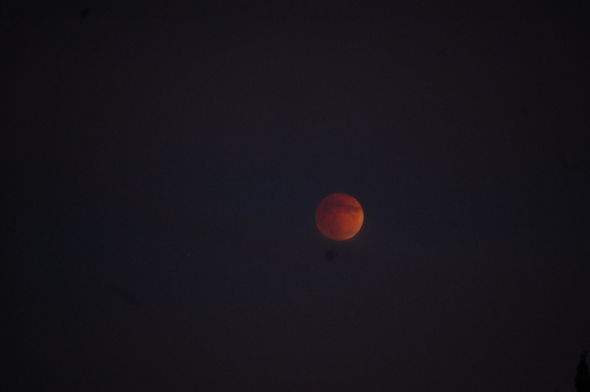
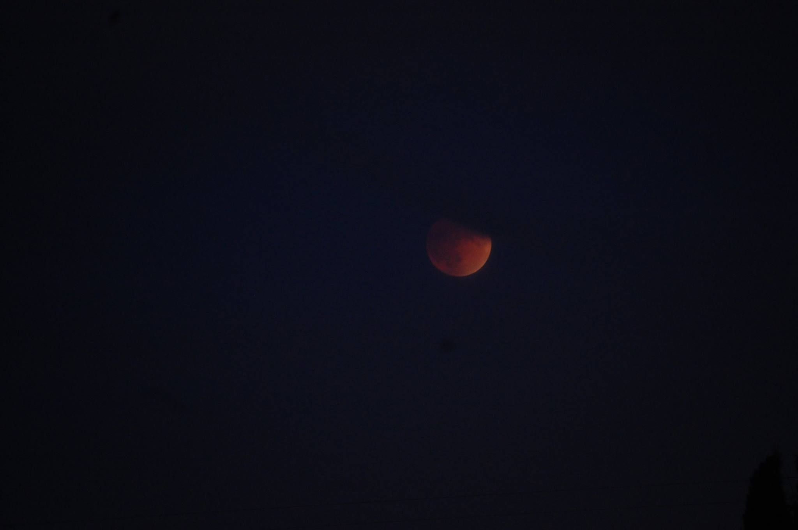
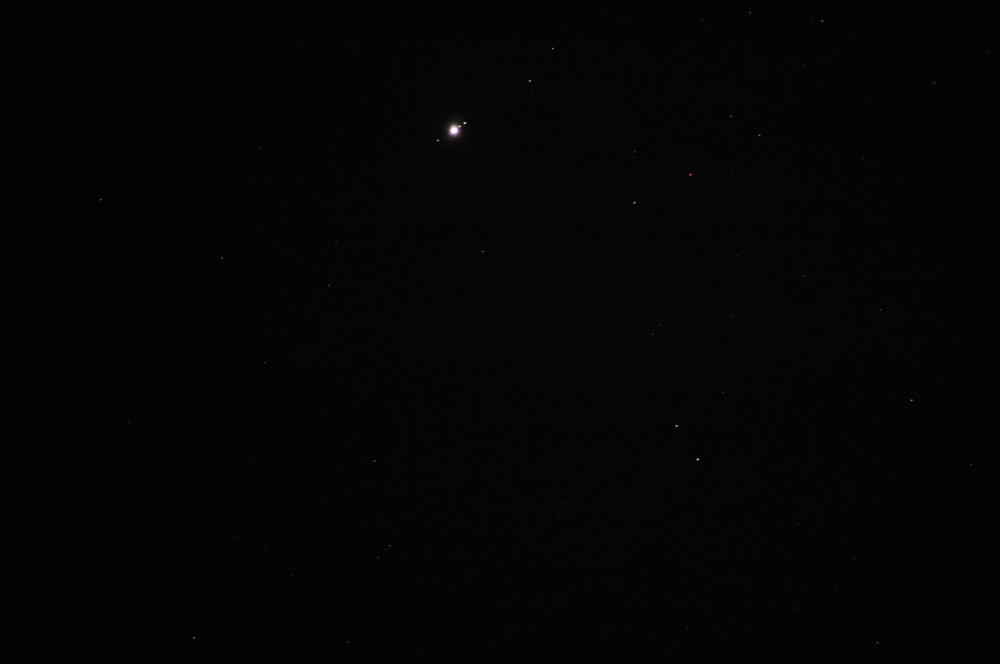
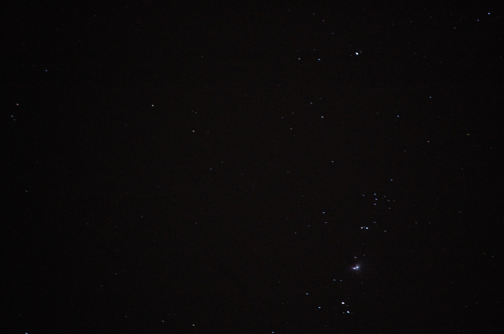
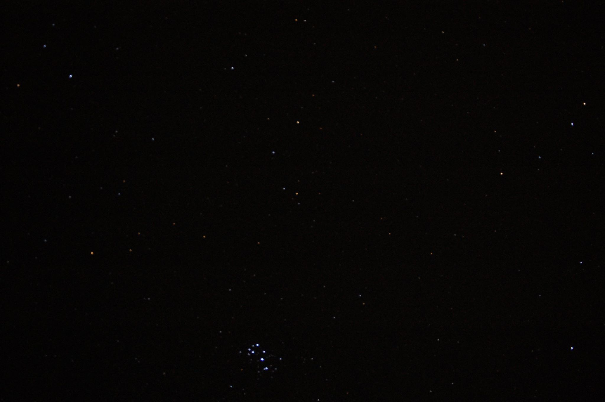
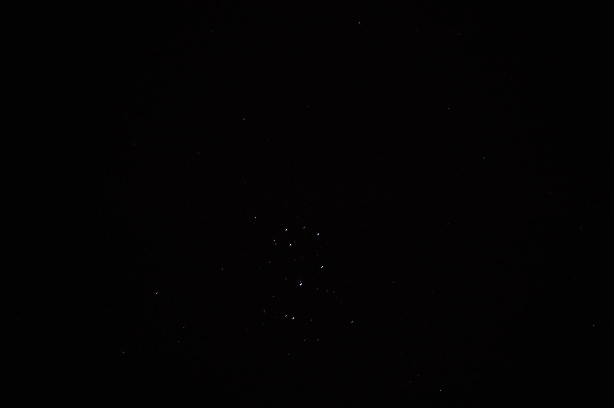
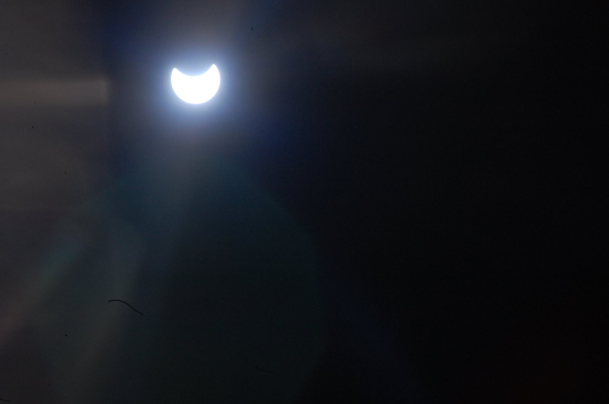
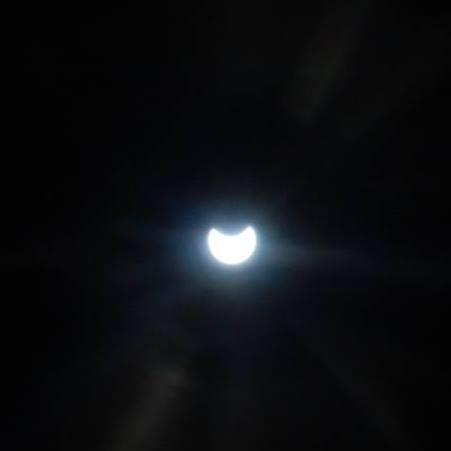
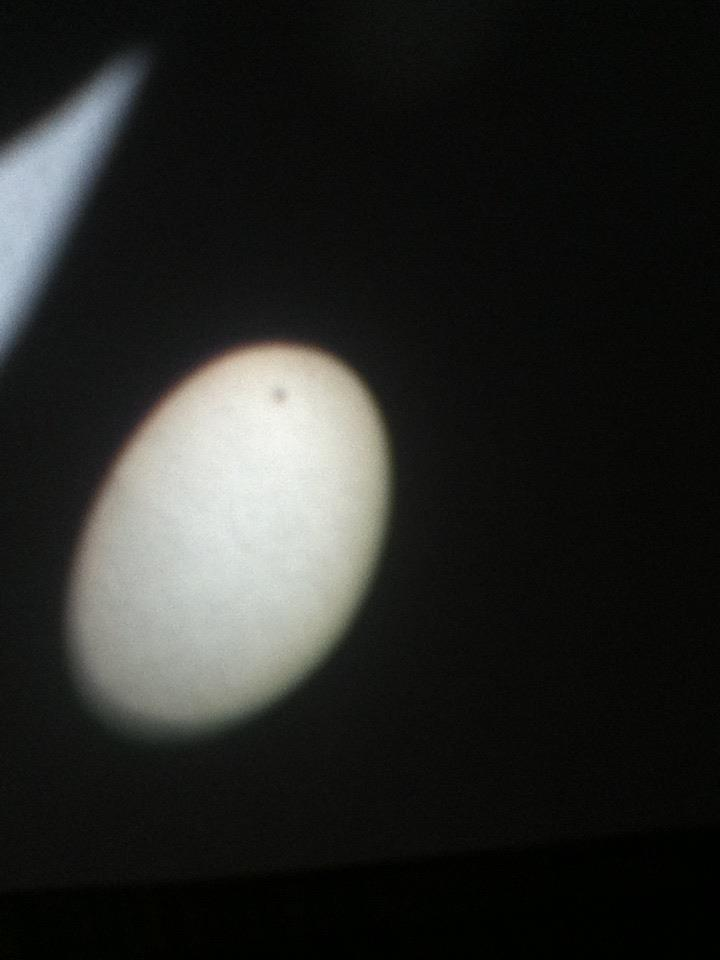
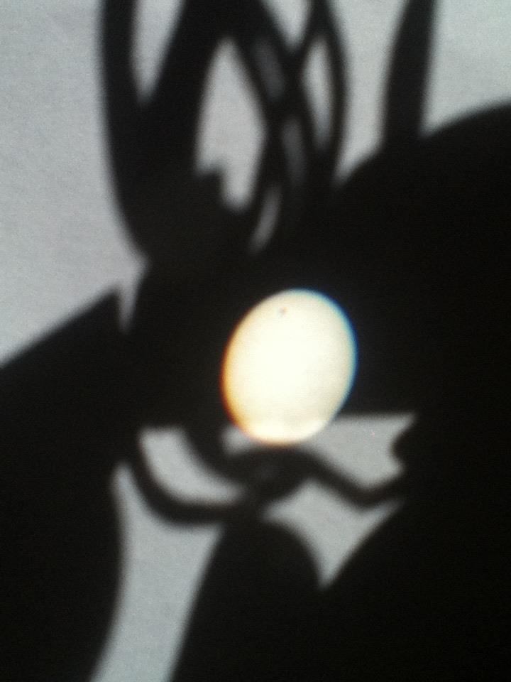

```{r setup, include=FALSE}
knitr::opts_chunk$set(echo = TRUE)
```
***
# Blood Moon (September 27, 2015)
{#id .class width=100% height=100%}

***

{#id .class width=100% height=100%}

***
# Jupiter and its moons
{#id .class width=100% height=100%}

***
# Orion Nebula
{#id .class width=100% height=100%}

***
# the Pleiades
{#id .class width=100% height=100%}

***

{#id .class width=100% height=100%}

***
# Partial Solar Eclipse (October 23, 2014)
{#id .class width=100% height=100%}

***

{#id .class width=100% height=100%}

***
# 2012 Transit of Venus
{#id .class width=100% height=100%}

***

{#id .class width=100% height=100%}
