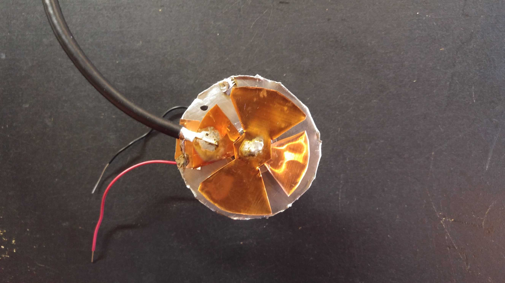
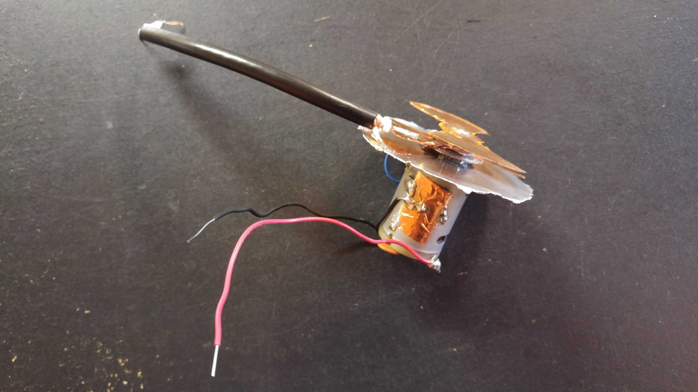
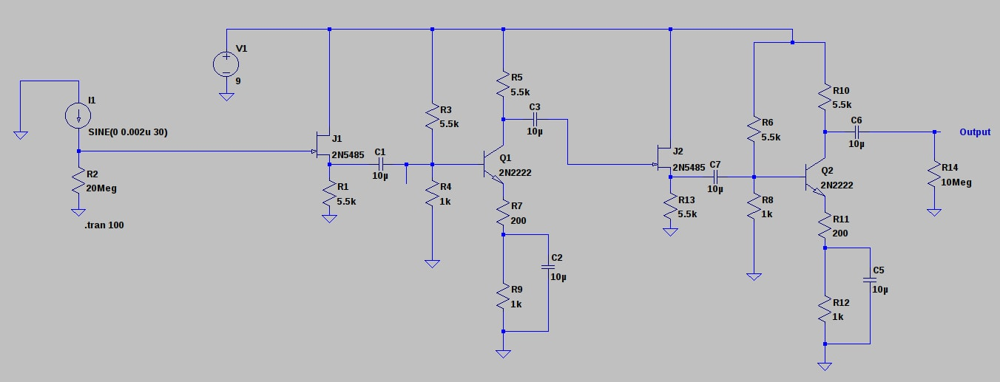
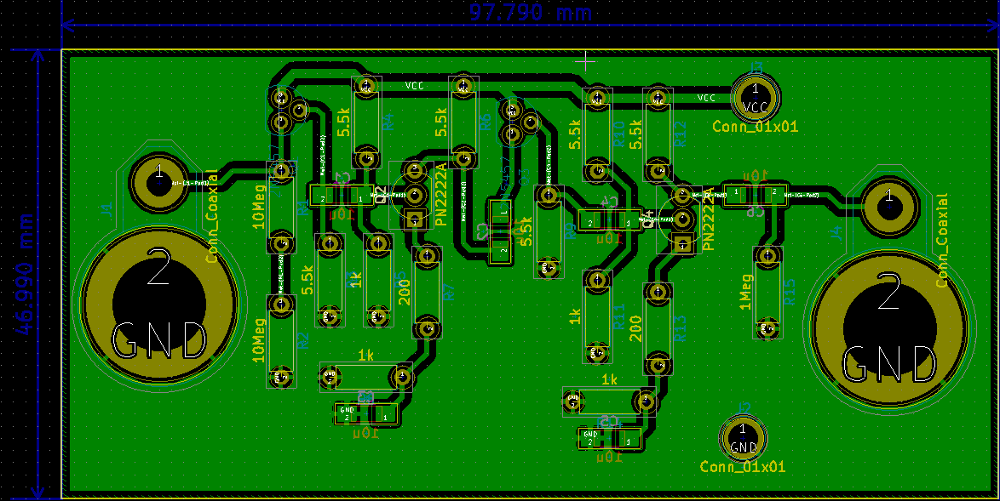
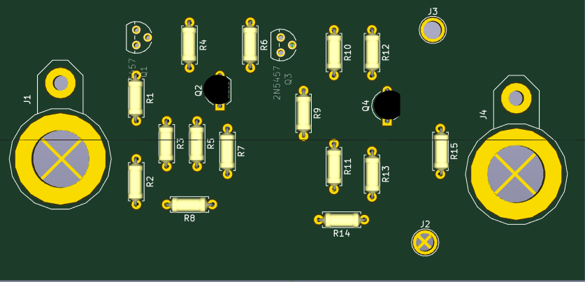
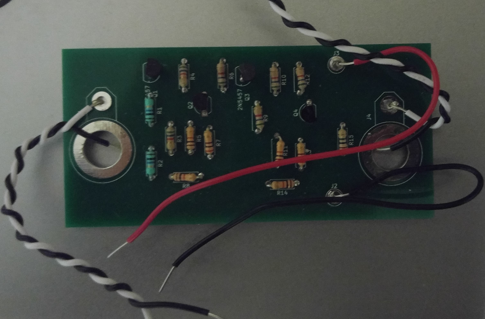

```{r setup, include=FALSE}
knitr::opts_chunk$set(echo = TRUE)
```

***
# Motivation

<center>
{#id .class width=50% height=50%}
</center>


A field mill is a method of measuring the strength of an ambient electric field. A motor rotates grounded metal vanes in front of a metal sensor plate, alternately shielding and unshielding the sensor plate. This induces an electric current from the sensor plate to ground of a magnitude proportional to the motor's speed and the strength of the ambient electric field. This current can be measured with a transimpedance amplifier.

Here's a side view of the field mill I constructed:

<center>
{#id .class width=50% height=50%}
</center>


The capacitor connected across the terminals of the motor is meant to reduce the AC noise generated by the motor's rotation.

# TIA Version 1
The below schematic depicts the transimpedance amplifier I first planned on using with my field mill. It's a fairly simple design composed of common-emitter amplifiers and JFET buffers. I1 represents the field mill itself, and the 20Meg ohm resistor provides a transimpedance of 20Meg. The amplifier after the 20Meg resistor provides a voltage gain of roughly 30 to further amplify the signal from the field mill.

{#id .class width=100% height=100%}


Here are a few snapshots from KiCad of the design:

{#id .class width=100% height=100%}

{#id .class width=100% height=100%}

## Testing Results
Here's a pic of the assembled amplifier. Initial tests made it clear that the circuit is highly vulnerable to low frequency powerline noise, possibly due to its high input impedance. Therefore, this circuit will need further refinement before it can be used with the field mill sensor.

{#id .class width=100% height=100%}


