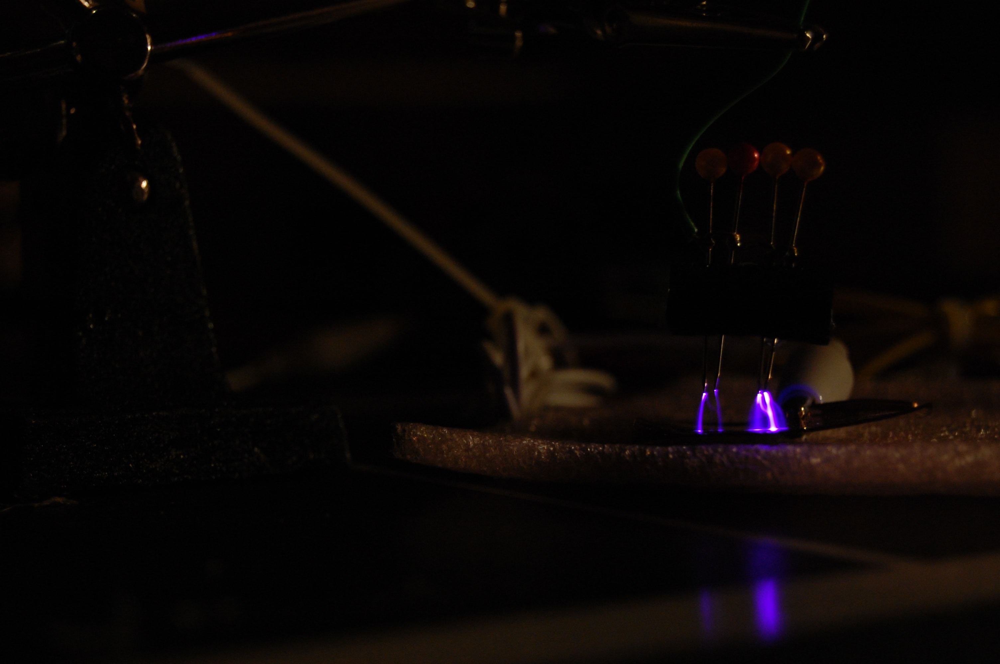
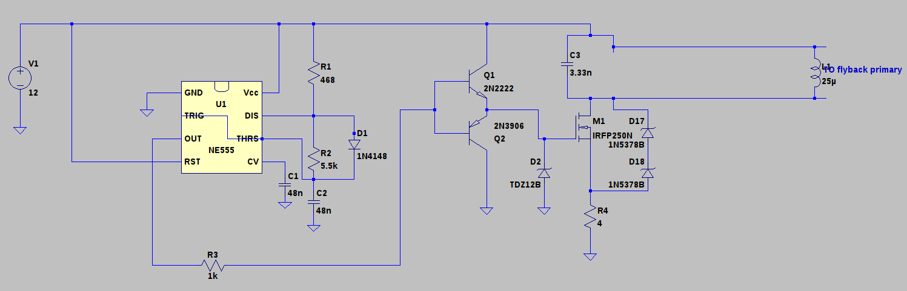
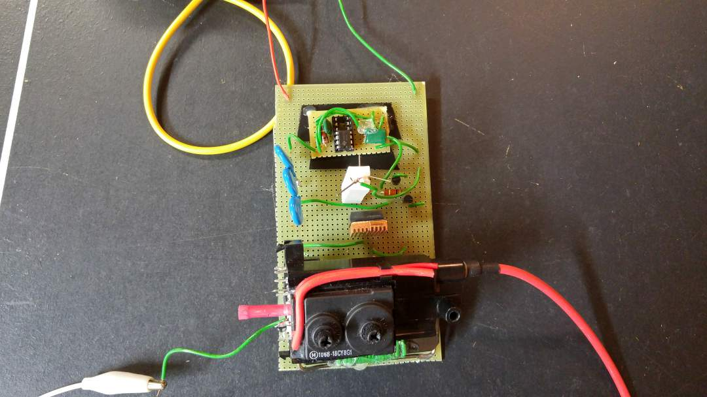
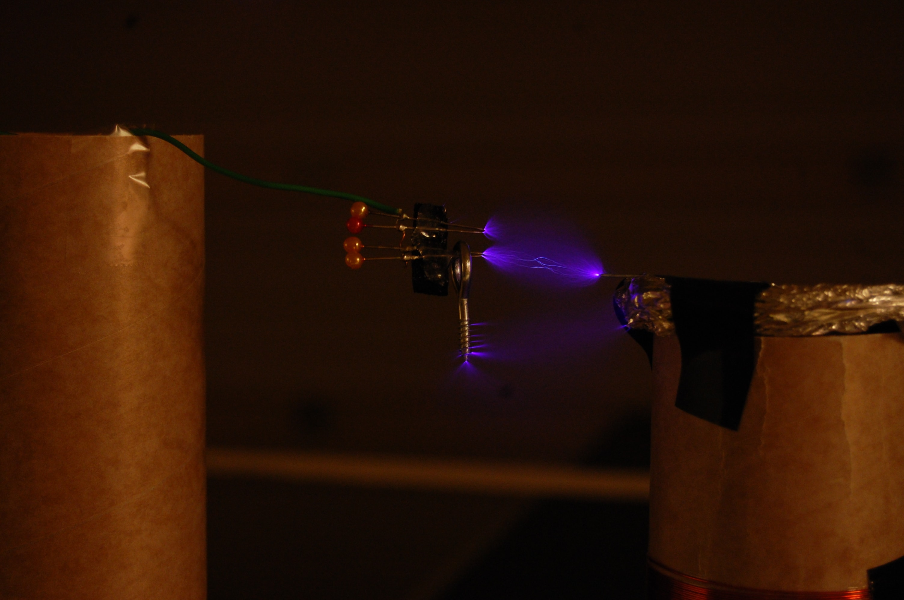

```{r setup, include=FALSE}
knitr::opts_chunk$set(echo = TRUE)
```
***
{#id .class width=100% height=100%}

Voltages upwards of 10 kV can be generated with a simple 555 IC circuit and a DC flyback transformer. I put this one together in a few days during my summer break.

# Schematic
{#id .class width=100% height=100%}
D2, D17 and D18 are TVS diodes matched to the specific MOSFET being used for switching, and the 25uH inductor represents the primary of the flyback transformer. Note that the 4 ohm resistor can get rather warm after extended operation.

# Pictures

{#id .class width=100% height=100%}

***

{#id .class width=100% height=100%}
