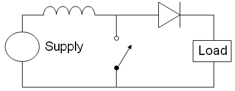
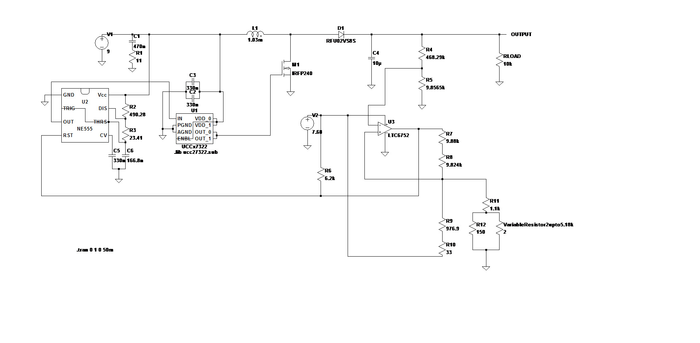

```{r setup, include=FALSE}
knitr::opts_chunk$set(echo = TRUE)
```
***

<center>
{#id .class width=30% height=30%}
</center>

A surprisingly high output voltage can be derived from a low supply voltage using a boost converter. For this project, I was able to obtain 200 V from a simple 9V battery with a duty cycle of 95.8%.

To attain a greater degree of control over the boost converter output, I implemented a Schmitt trigger feedback circuit with a LM2903 dual comparator (1 of the comparators was left unused). The variable resistor (in the lower right hand corner of the below schematic) within said circuit allows the user to alter the output of the converter from 200V to roughly 217V. 



I implemented the above schematic as written, save for the diode, MOSFET, and LTC6752 comparator. In their stead, I utilized a UF4007 diode, a IRFP250 MOSFET, and a LM2903 dual comparator. The 7.68V in the schematic was supplied via a LM7808 linear regulator (which was setup with a 0.1 uF capacitor between GND and the 7.68V output).

# Pictures

{#id .class width=70% height=70%}

***
{#id .class width=70% height=70%}

***

When tested with a 9.44V battery and set to produce roughly 200V with the variable resistor, its output falls to 110V when loaded with a 5.53k resistor, and 175V when loaded with a 33.2k resistor. It's clear that this circuit can't supply much power, despite its high output voltage.

