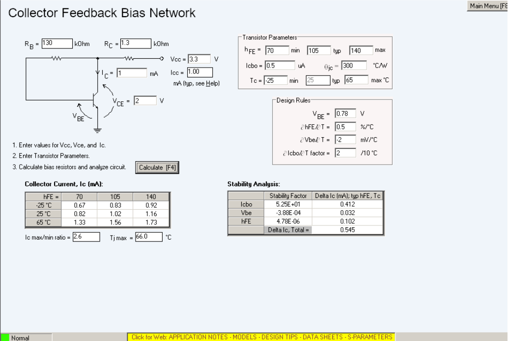

```{r setup, include=FALSE}
knitr::opts_chunk$set(echo = TRUE)
```

***
# Motivation
This is the 1st revision of the TIA circuit that was used with the field mill sensor described [here](fieldmill.html).

***
# Device Selection
A 2SC2714-O NPN transistor was selected as the gain element of the transimpedance stage, mainly for its 2.5 dB noise figure (measured at 100 MHz, Ie = 1 mA).

### Part Statistics
Number | Max Vce (V) | Ft (MHz) | Max Ic (mA) | Min hFE | Max hFE
-|-|-|-|-|-
2SC2714-O | 30 | 550 | 20 | 70 | 140
### SPICE Model
```
.MODEL 2SC2714 NPN( IS=1.45E-15 BF=166 NF=1.00 VAF=71 IKF=49E-3 ISE=43E-15 NE=2.45
BR=5.33 NR=997E-3 VAR=22 IKR=69E-3 ISC=847E-18 NC=1.02 RB=14 IRB=1.00E-6 RBM=14
RE=46E-3 RC=9.17 XTB=0.00 EG=1.11 eV XTI=3.00 CJE=1.66E-12 VJE=717E-3 MJE=331E-3
TF=153E-12 XTF=100 VTF=383E-3 ITF=90E-3 PTF=47 CJC=781E-15 VJC=630E-3 MJC=462E-3
XCJC=1.00 TR=1.00E-6 FC=900E-3)
```
### Bias Point
Assume a Vcc of 3.3 V, for compatibility with 1.5 V and 3.6 V battery cells. Choose Vce = 2 V, Ic = 1 mA for an approximate 2 Vpp output swing and a low noise figure (the BJT only seems to be specified for Ic = 1 mA in the datasheet).
The collector-feedback bias circuit needed to achieve this (as calculated in AppCad) is:
<center>
{#id .class width=75% height=75%}
</center>

***

# Circuit Topology Small Signal Analysis
### BJT Hybrid Pi Model
Ic (mA)| Ft (MHz) | gm (mOhms^-1) | Cpi (pF) | Min hFE | Max hFE | Min Rpi (Ohms)| Max Rpi (Ohms)|
-|-|-|-|-|-|-|-
1 | 550 | 38.4 | 11 | 70 | 140 | 1822 | 3645
### Circuit Topology
Assume a shunt-feedback topology for convenience:
<center>
{#id .class width=50% height=50%}
</center>
The DC gain is:
$$\frac{V_o}{V_i}=\frac{G_f-g_m}{G_f+G_l}$$
The input resistance is:
$$R_{in}=\frac{R_{\pi}}{1+R_{\pi}G_f(1-A_v)}$$
The DC transimpedance gain is:
$$\frac{V_o}{I_i}=\frac{A_vR_{\pi}}{1+R_{\pi}G_f(1-A_v)}$$
For a large $A_v$, this gain formula reduces to $R_f$.
From the perspective of $C_\pi$, the circuit time constant is:
$$\tau_1=\frac{C_\pi}{g_m+g_\pi+G_lA_v}$$
From the perspective of $C_l$, the time constant is:
$$\tau_2=\frac{C_l}{G_l+(1+\beta)(\frac{1}{R_f+R_\pi})}$$
The dominant pole then has a time constant of $\tau=\tau_1+\tau_2$.
The input noise current can be calculated from $R_f$:
$$i_n^2=4kT\times F_{3dB}/R_f$$
where $4kT=1.62\times10^{-20}$ at 20 deg C.
To account for additional resistors in parallel with $R_f$, note that the noise current powers simply add.

***

# Audio Amplifier Stage Design
To convert the TIA output into an audio line level signal, use an appropriate audio amp IC:

Part Num | Input Voltage Range | Load Impedance | 1% THD Pout with Vdd=3.3 V
-|-|-|-
LM4818 | -0.3 V to VDD+0.3 V | 16 Ohms | 120 mW

We want a large input resistance with respect to the BJT collector resistance and a moderate gain so that the LNA's noise figure is dominant. For this, choose $R_{in}=22\ k\Omega$ and a gain of 3 V/V.
It is desirable for the passband to omit 60 Hz (powerline frequency). Therefore, choose a bandwidth of 70 Hz to 20 kHz.

The general circuit for the LM4818 is:
<center>
{#id .class width=50% height=50%}
</center>
$R_i$ is simply the desired input resistance (22 kOhms). Since $A_v=2(R_f/R_i)\to 1.5=R_f/R_i$, $R_f=33\ k\Omega$. Set the 3dB frequency of the $R_i+C_i$ high-pass element to $0.2\times 70\ \textrm{Hz}$. Therefore, $C_i>0.517\ \textrm{uF}$.
The resultant component values are:

$R_i$ | $R_f$ | $f_l$ | $f_h$ | $C_i$ | Required GBWP | $C_B$ | $C_{B2}$ | $C_s$
-|-|-|-|-|-|-|-|-
$22\ k\Omega$ | $33\ k\Omega$ | 14 Hz | 20 kHz | 0.56 uF | 300 kHz | 1 uF | 0.1 uF | 1 uF 

***
# LNA Component Value Calculations
In QucsStudio:
<center>
{#id .class width=50% height=50%}
</center>

In Excel/Libreoffice (using the small-signal analysis equations):
<center>
{#id .class width=75% height=75%}
</center>

Monte Carlo Simulation (1000 runs):
<center>
{#id .class width=60% height=60%}
</center>

***
# 3.3 V Supply
A 3.3 V LDO (TLV70033) was found on Digikey to supply the needed voltage.

***
# Layout

### Schematic
<center>
{#id .class width=60% height=60%}
</center>

### PCB
<center>
{#id .class width=60% height=60%}
</center>

Note the usage of a grounded guard ring for shielding the input. The previous TIA design had a relatively high input resistance, increasing its sensitivity to E-field noise (which appears as a noise current in shunt with the input). Although this isn't the case for the current revision of the circuit, it's almost always better to shield high gain inputs.