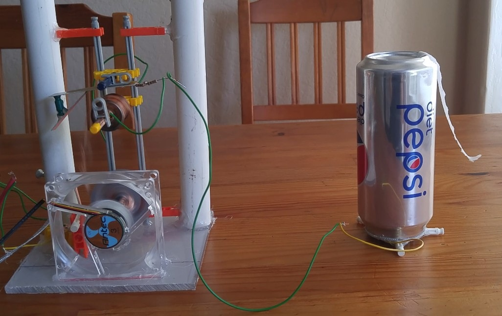

```{r setup, include=FALSE}
knitr::opts_chunk$set(echo = TRUE)
```
***
{#id .class width=100% height=100%}

# Motivation

<center>
{#id .class width=50% height=50%}
</center>

A Pelletron is an electrostatic machine that uses a moving belt to transport charge to the interior of a high voltage electrode, much like a Van de Graaff. However, a Pelletron belt consists of a series of metallic pellets separated by insulating material, and travels upon 2 conductive rollers. Instead of relying on the triboelectric effect and corona discharge to transport charge to the high voltage electrode, a Pelletron inductively charges belt pellets, and moves them to the top roller where they are inductively discharged into the high voltage electrode. 

There isn't much information available online about building Pelletrons (unlike Van de Graaff generators), so I decided to try figuring out the specifics myself.

# Structural Components

## Belt

I built the belt with a strip of polypropylene cut from an old sheet protector, and sections of copper tape. As can be seen from the later photos, the copper tape sections serve as the "pellets", and the polypropylene holds everything together. The combined polyprop-copper tape strip was superglued with cyanoacrylate into a loop.

## Charging Assembly (Bottom roller)
{#id .class width=100% height=100%}


I ended up implementing the motorized bottom roller with a small 12V computer fan I purchased from Fry's, and old bits of K'nex that were lying around the house. To make it conductive, I coated it with pieces of copper tape.

Because the conductive bottom roller is responsible for charging each copper pellet, it needs to be connected to the positive terminal of a high voltage power supply. For this project, I ended up using the circuit I built [here](hv555.html). The red wire from the flyback was hooked up to the bottom roller, while the green negative wire was connected to the bottom inductor.

## Discharging Assembly (Top roller)

{#id .class width=100% height=100%}

The conductive top roller was simply constructed from a plastic cylinder I found in an old sewing kit, and copper tape. I connected it to the top electrode with an arrangement not dissimilar to a slip ring.

The top inductor was directly connected to the negative terminal of my high voltage supply, and connected to the top roller through 2 1 MegOhm resistors.

## High Voltage Terminal
{#id .class width=100% height=100%}

For the high voltage terminal, I just cleaned out a soda can I bought from CVS, and hooked its interior up to a wire with tape.

# Demo
{#id .class width=100% height=100%}

Here's a picture of it running!
