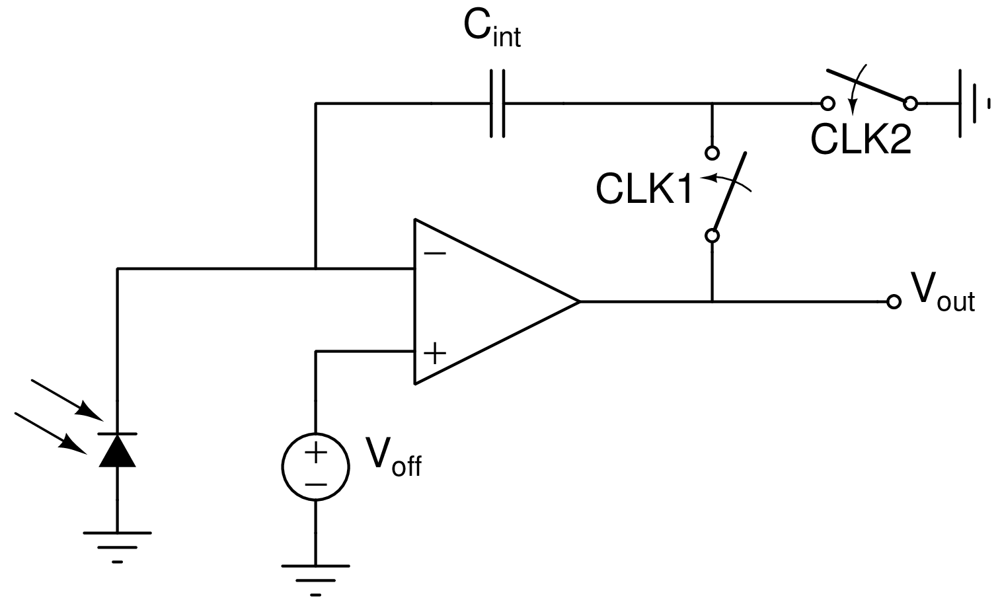
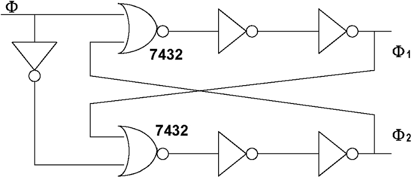
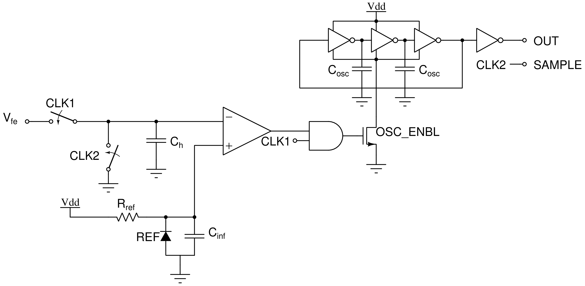
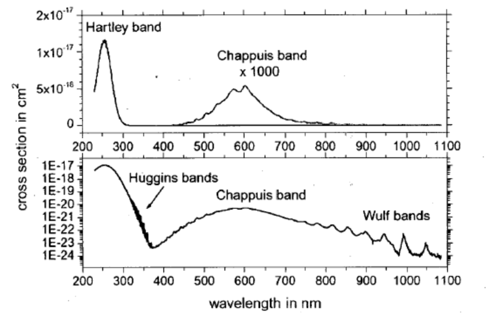
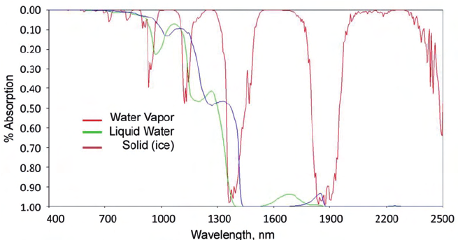

```{r setup, include=FALSE}
knitr::opts_chunk$set(echo = TRUE)
```
***
# Page Summary
This page serves to document my forays into optical photometry based on the 
works of Forrest Mims. Most of this information is taken from the book `Atmospheric Monitoring with Arduino`.

***
# Inventory of Available LEDs
- 660 nm red LED (5)
- RGB LED (2)
- 522 nm green LED (5)
- 470 nm blue LED (5)
- 605 nm orange LED (5)
- 589 nm yellow LED (5)
- 940 nm IR LED (5)
- 875 nm IR LED (3)

***
# LED Characterization
## Procedure
1. Sweep RGB LED color throughout entire range available with ATTINY85 and PWM or Arduino Uno.
2. Record LED output with ADC/integrating counter vs. color.
3. Plot to determine peak of response.

***
# Photocurrent measurement technique (TDC)

## Front End
<center>
{#id .class width=50% height=50%}
</center>

The above is a parasitic-insensitive offset voltage canceling charge sensitive detector. When CLK2 is high, the charge on the cap is reset to $-C_{int}V_{off}$.
When CLK1 is high, this initial charge is canceled out and the output voltage is:

$$V_{out}=\frac{I_{photocurrent}}{C_{int}}t$$
The parasitic capacitance at the op-amp inverting input has a negligible effect, and any random offset from the op-amp is canceled out.

This circuit requires two non-overlapping clocks. The below generator using a hex inverter and 2 nor gates (try the 7432 IC) can be used:

<center>
{#id .class width=50% height=50%}
</center>
Otherwise, non-overlapping slow clocks can be generated with the ATTINY85.

The switches can be implemented with the CD4016B IC.

## TDC Backend
<center>
{#id .class width=50% height=50%}
</center>

The output voltage from the analog front end is fed into the inverting input of the comparator and used to enable a ring oscillator whose edges are counted by an ATTINY85. The capacitor $C_h$ is simply present to hold the inverting input voltage at ground when CLK2 and CLK1 are both low, and the REF is simply a voltage reference IC. The rising edge of CLK2 serves as a valid signal for the ATTINY85 counter.

***
# Photometer Calibration
Since the photometer sensor is meant to be pointed directly at the Sun during measurements, it may help to build aligning tools into the photometer casing.
Otherwise, stick to noon measurements when the Sun is highest.
Make sure to record the time of measurements.

## Intuition
The specific position of the Sun at noon changes as the Earth orbits the Sun.
B/c the sunlight is passing through a different amount of air mass at different points in the year, photometric measurements are significantly impacted.

Air mass is simply defined as: $m = 1/sin(theta)$ where theta is the angle of the sun above the horizon. This quantity can be calculated from location and time, or directly measured with a clinometer.

The change in air mass over the course of the year can be de-embedded by calculating the atmospheric optical thickness (AOT). AOT gives the air clarity for any given air mass (the true reading of the Photometer) and can be found with Langley extrapolation.

## Procedure
1. Wait for a very clear day (constant humidity, no cloud cover, no atmospheric haze). Alternatively, wait for an overcast day with uniform cloud cover.
2. Take measurements every half hour for half of the daylight hours (dawn to noon or noon to sunset).
3. Measure the sun's angle above the horizon at each measurement.
4. Plot the log of the LED data on the y-axis against the air mass on the x-axis.
5. Extrapolate linearly to find the y-intercept where the airmass is zero, the extraterrestrial constant (EC).
6. The EC serves as a calibration constant specific to the photometer.
7. Calculate AOT using the EC:

$$AOT = (log(EC)/log(LED data))\times\frac{1}{m}$$

*** 
# Applications of Available LEDs

***
# Ozone Detection
<center>
{#id .class width=50% height=50%}
</center>

## Required LEDs
- 589 nm yellow LED
- 660 nm red LED

Taking the ratio of the readings from these two LEDs (one with a response near the Chappuis band, and one with a peak freq. above it) gives ambient ozone.

***
# Twilight Haze Measurement
- requires 660 nm or 880 nm LED

## Measurement Procedure
1. 10 minutes before sunset or 45 minutes before sunrise on a clear day, lay the photometer facing straight up on a level surface outdoors away from light sources.
2. Record data at 1-second intervals.

### Caveats
1. The photometer needs a large dynamic range!

## Data Processing Procedures
### Intuition
The "twilight intensity" measured at any given time by the photometer correlates
 with the "height" of Earth's shadow. For the sunset measurement case, the photometer measures the reduction in light as the sun sinks below the horizon. The reverse is true for the sunrise measurement.

The height of Earth's shadow can be calculated from your location and elevation at any given time. Plotting this on the y-axis against the intensity measured by the photometer gives an idea of the heights at which there are significant concentrations of aerosols with dips in the measured intensity.
Taking the derivative of the intensity before plotting serves to emphasize seemingly insignificant changes.

## [Reference](https://makezine.com/projects/twilight-photometer)

# Atmospheric Haze
- red LED
- green LED
Atmospheric haze is produced by aerosols, which scatter higher frequencies of light more effectively than lower frequencies.

Therefore, the difference between the photocurrent of the red and green LEDs should give the amount of haze that day. The green LED will generate less photocurrent when there is more haze.

# Photosynthetically Active Radiation
- Blue LED
- Red LED

Photosynthetically active radiation (PAR) refers to red or blue light that is used for photosynthesis. Summing the readings from the blue and red LED gives the amount of PAR available on a given day.

# Water vapor (WV)
- 940 nm LED
- 880 nm LED
<center>
{#id .class width=50% height=50%}
DOI: 10.1560/IJPS.60.1-2.9
</center>

Water vapor has an absorption band around 940 nm (see above). Comparing the output of the 940 nm LED with the 880 nm LED gives the amount of WV in the atmosphere.
B/c of the high dependence of WV on local weather (clouds, raining, snowing), better results can be obtained for measurements of upper atmospheric water vapor (above the weather) on clear days.


