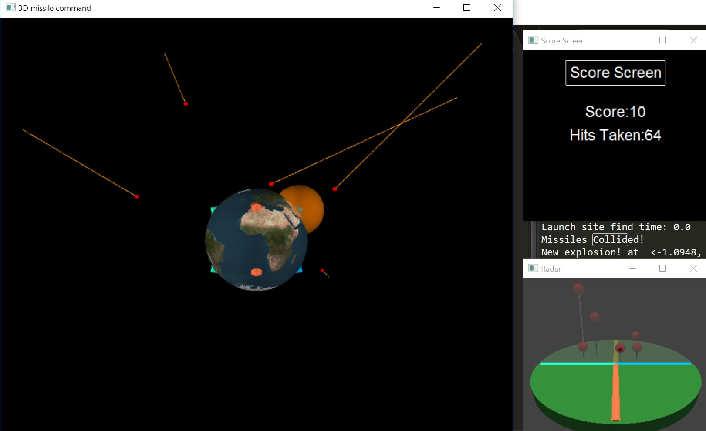
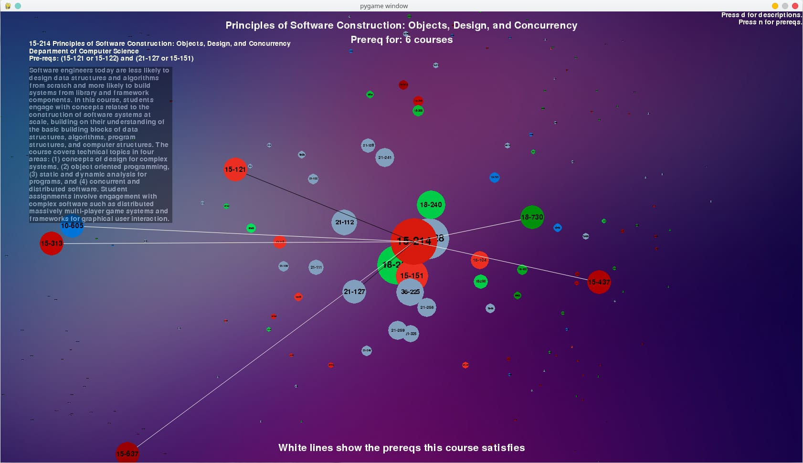
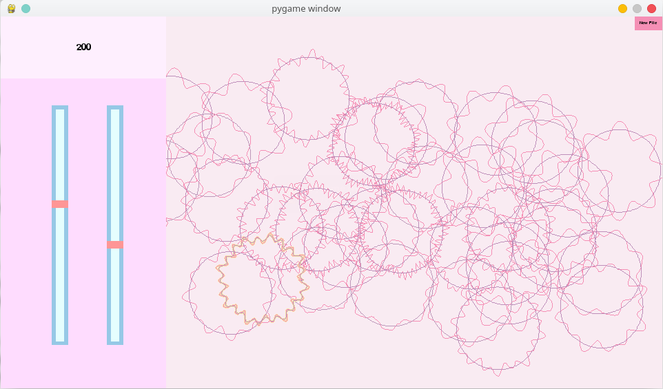

```{r setup, include=FALSE}
knitr::opts_chunk$set(echo = TRUE)
```
***
# Hackathon Projects
***

## [Hack112 Fall 2016](https://github.com/yshen-1/hack112)
{#id .class width=100% height=100%}
Three of my friends and I collaborated to develop this 3D variant of the popular 1980s game Missile Command for Hack112, a hackathon at Carnegie Mellon University designed for those new to computer science. Players defend a 3D globe from incoming missiles with the aid of a basic radar screen and anti-missile batteries.

## [TartanHacks 2017](https://github.com/yshen-1/tartanHacks)
{#id .class width=100% height=100%}
Three of my friends and I collaborated to develop this CMU STEM course visualizer for TartanHacks, one of Carnegie Mellon University's largest hackathons. By plotting out STEM courses at CMU as a web with higher-level courses branching outwards from their pre-requisites, CMU Course Galaxy can help users chart out their path at Carnegie Mellon.

# School Projects
***
## [CMU 15-112 Term Project](https://github.com/yshen-1/CMU15112-TermProjectPlus)

As a term project for my CS introductory course at Carnegie Mellon University, I developed an audio visualization game that first analyzed a .wav audio file to acquire the time-stamps of its beats, and then played the audio file, generating poppable bubbles at times corresponding to the beats in the audio. After submitting my project, I made an effort to improve upon its flaws, ultimately resulting in a new color-scheme, a new game mechanic in which the game window becomes increasingly shaded over with a pink overlay as beats occur, and a fix for a bug in the original project that caused the game to crash when the player pressed the button for selecting a new audio file. The hyper-link in the heading of this description refers to the Github repository containing this improved program, while users interested in the original term project can head [here](https://github.com/yshen-1/CMU15112-TermProject).

# Personal Projects

## [Tidy Bibliometrics](tidy_biblio.html)
