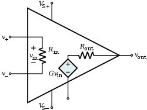
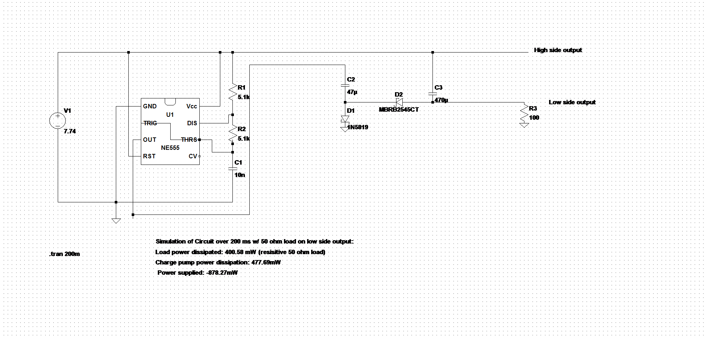
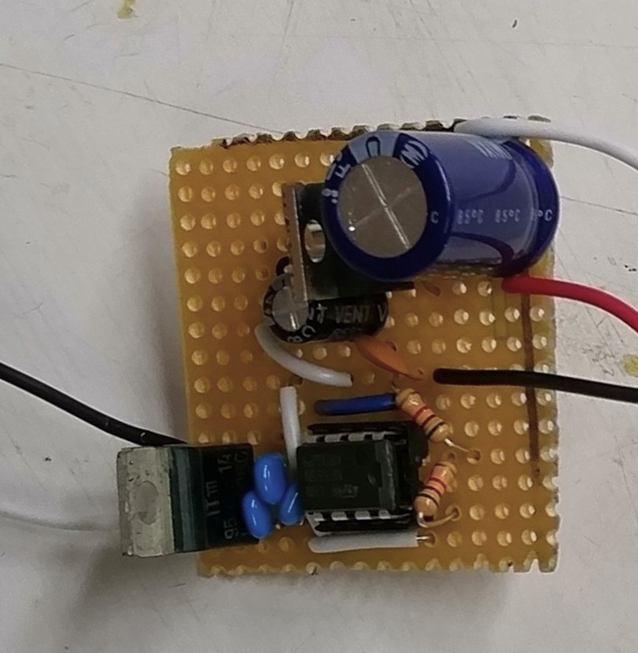
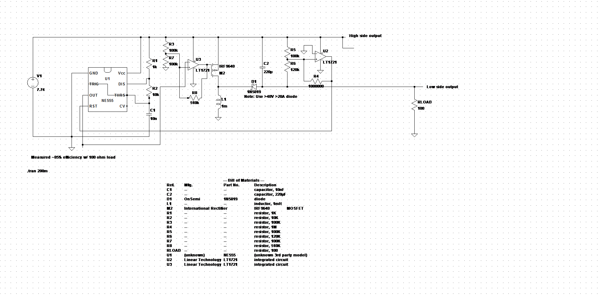
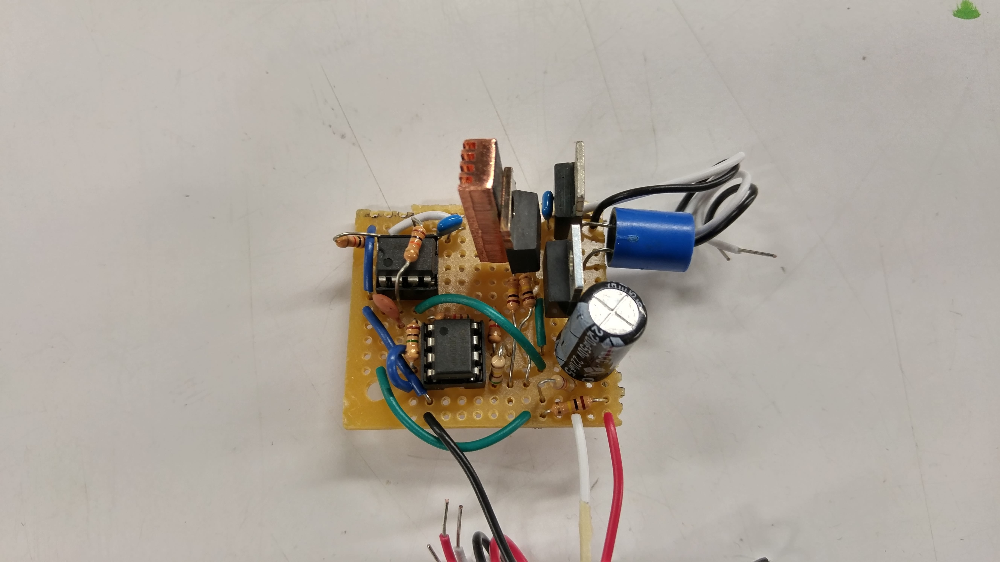

```{r setup, include=FALSE}
knitr::opts_chunk$set(echo = TRUE)
```
***
# Motivation

<center>

{#id .class width=20% height=20%}

</center>

Many op-amps are classified as dual-supply op-amps, which use a positive, and a negative voltage supply rail to allow their outputs to swing above and below ground. Generating a positive and a negative rail from a unipolar power supply like a normal 9V battery can be accomplished through a specialized power conversion circuit, such as a SMPS or charge pump. This page documents an example of both types of circuits.
 
# Inverting Charge Pump

<center>

{#id .class width=100% height=100%}

</center>
One particularly simple, but inefficient way of generating a negative voltage rail from a positive voltage source is through an inverting charge pump. To develop a negative voltage, this circuit uses diodes to steer the square wave from a 555 timer oscillator into charging the output capacitor C3 with a negative voltage.

<center>

{#id .class width=40% height=40%}

</center>


I implemented the above schematic as written, save for Schottky diode D2. Because LtSpice simulations indicated that D2 would need to pass a significant amount of electrical current, I utilized a large 45V ~16A diode I found in CMU's Robotics Club instead of the part listed in the schematic. To supply the 7.74V, I just used a LM7808 8V voltage regulator.

This relatively compact circuit's negative voltage falls to -3.67V when supplying 37 mA, and -5.68V when supplying roughly 5.7 mA. Because the positive voltage rail can be taken directly from the output of this circuit's voltage regulator, the positive voltage of this circuit will remain relatively constant around 7.74V unless >1A is drawn.

# Inverting Buck-Boost Converter
<center>
{#id .class width=100% height=100%}

</center>


Another method to generate the negative voltage required by a dual supply op-amp is through the usage of an inverting buck-boost converter. Although it is far more complex than a charge pump, it is more efficient and is capable of supplying much more power.

One of the problems with utilizing the reactions of an inductor to generate a negative voltage is that the inductor generates short, tall spikes of negative voltage every time current through the inductor is switched on and off. This makes it very difficult to control the value of the negative voltage the inductor charges the output capacitor to. Therefore, the above circuit uses a Schmitt trigger to act as a feedback system for the converter (U2 in the schematic). When the voltage at the output capacitor goes below a certain amount, the Schmitt trigger turns off the 555. If the voltage goes above a specific reference voltage, the Schmitt trigger turns the 555 back on. This permits the converter to charge the output capacitor to a specific negative voltage, making the circuit somewhat more useful than the aforementioned inverting charge pump.

<center>
{#id .class width=40% height=40%}
</center>

I implemented the above schematic as written, save for the MOSFET, the diode, and the comparators marked U2 and U3. I used an IRF9540 for the MOSFET, the same type of 45V 16A Schottky diode used in the charge pump, and a LM2903 dual comparator for U2 and U3. To supply the 7.74V, I used yet another LM7808 8V regulator chip. As with the charge pump, I was able to pack the components into a rather small section of protoboard, although the larger number of components made it rather challenging. As a precaution, I added a small copper heat sink to the MOSFET.

Compared to the charge pump, this circuit can deliver much more power. Its negative output can deliver 10.9 mA while maintaining a voltage of -10.8V, and roughly 102.6 mA while maintaining a voltage of -10.18V. As with the charge pump, the positive output's voltage will remain fairly constant as it is taken directly from the output of the LM7808 voltage regulator.
