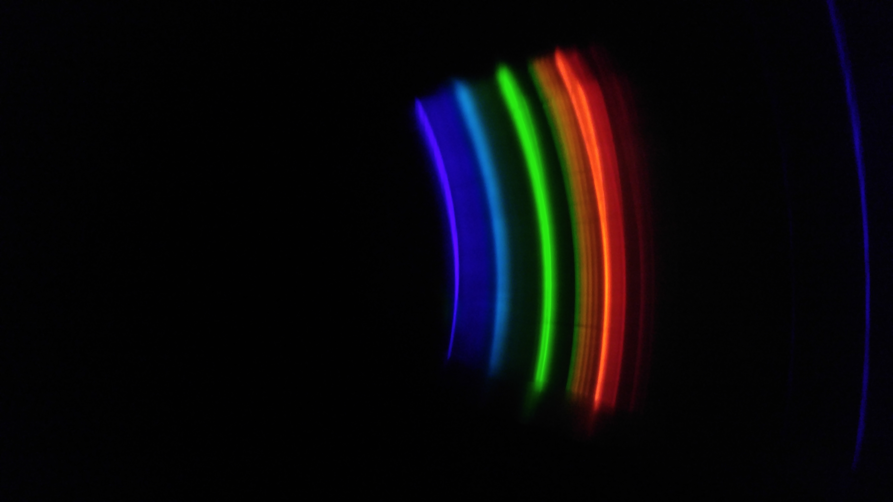
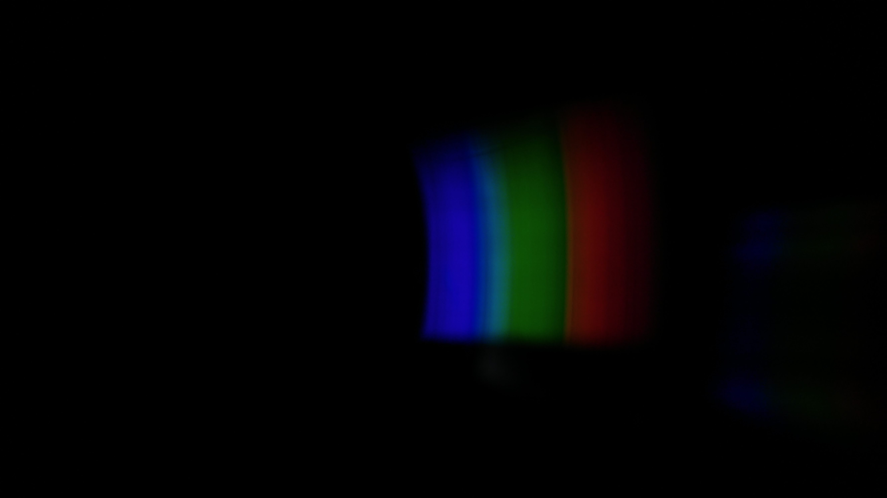
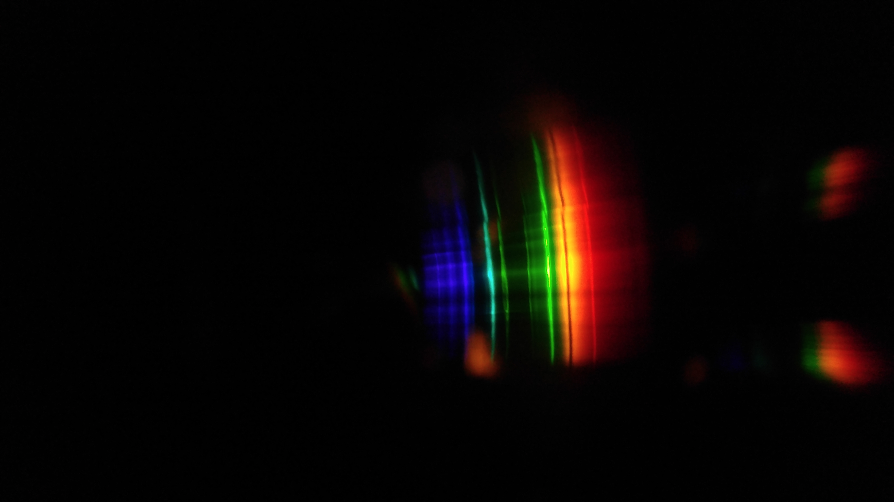

```{r setup, include=FALSE}
knitr::opts_chunk$set(echo = TRUE)
```

***

# Description

Surprisingly detailed spectra can be captured with a generic CD spectroscope and a cell phone camera. This page displays a few of the spectra I've managed to acquire with such a setup.

# Compact Fluorescent Bulb

***

# Sol (with Fraunhofer lines)

***

# Neon bulb

***

# Sodium lamp

***

