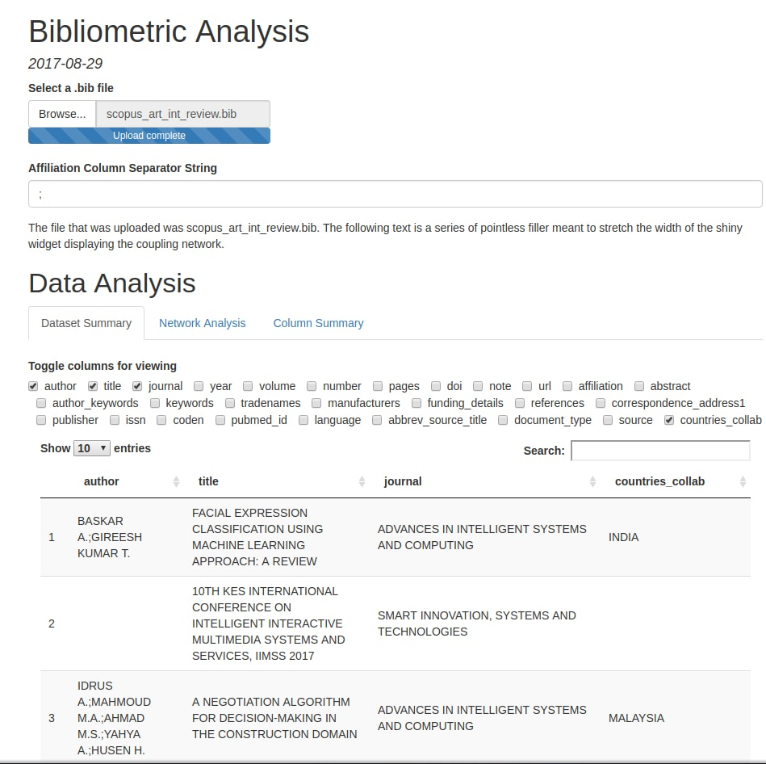
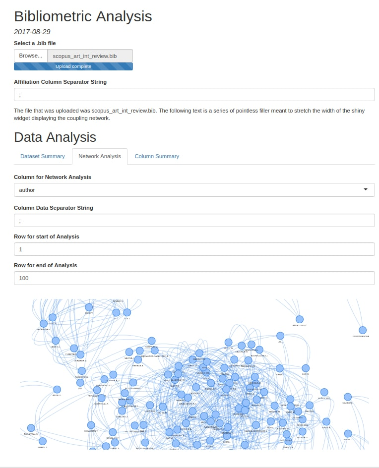
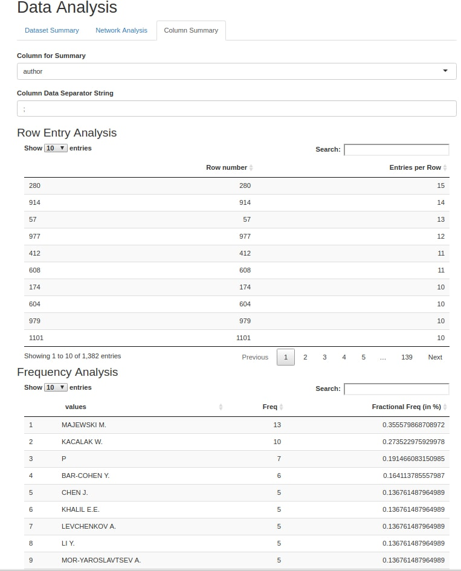

```{r setup, include=FALSE}
knitr::opts_chunk$set(echo = TRUE)
```
***

# Project Summary

In the summer of 2017, I collaborated with Richard Yang to start developing a more user-friendly version of the R package `bibliometrix`, a popular bundle of functions used for the analysis of records downloaded from ISI Web of Science and Scopus.

My package, which is still under development and can be found at my [Github](https://github.com/yshen-1/tidy_bibliometrics), provides a set of functions that perform similar tasks to those of `bibliometrix`, but in a more refined manner.


# Function Documentation
Function Name | Description
-|-
read_files(...) | `read_files("pathToFile1", "pathToFile2", ...)` takes in the paths to bibtex files downloaded from ISI and Scopus, and returns a list of character vectors. Each character vector contains the full text of one of the files.
convert2df(text_list) | `convert2df(text_list)` takes in an object returned by `read_files()` and returns a list of tibbles. Each tibble corresponds to the parsed data from each bibtex file taken in by `read_files()`
tidydf(list_of_tibbles) | `tidydf(list_of_tibbles)` takes in a list of tibbles returned by `convert2df()` and performs basic data tidying operations on each tibble (coercing columns containing digits to the numeric data type, capitalizing each character column, adding a proper data entry separator string to the author column of each tibble).
set_separator(tidied_tibble, column_name, data_separator_string) | `set_separator(tidied_tibble, column_name, data_separator_string)` takes in a singular tibble from the list of tibbles returned by `tidydf()`, the name of a target column in that tibble, and the data separator string the user wishes to set for that column. The function returns the tibble inputted by the user, but with the target column tidied (whitespace is trimmed and characters are capitalized) and given a "sep" attribute set by the data separator string.
extract_affiliated_countries(tidied_tibble) | `extract_affiliated_countries(tidied_tibble)` takes in a tibble generated by `set_separator()` (with column_name="affiliation") and returns that same tibble with an additional column indicating which countries are affiliated with each paper.
col_analysis(tidied_tibble, column_name) | `col_analysis(tidied_tibble, column_name)` takes in a tibble generated by `set_separator()` (with the target column of `set_separator()` set to column_name), and the name of a column within the tibble. This function returns a list of 2 tibbles, one of which contains information on how many data entries are present within each row of the column named in the arguments of `col_analysis()` while the other contains a frequency analysis of each data entry within the column named in the arguments.
network_analysis(tidied_tibble, column_name, row1, row2) | `network_analysis(tidied_tibble, column_name, row1, row2)` takes in a tibble generated by `set_separator()` (with the target column of `set_separator()` set to column_name), the name of a column within the tibble, and the row numbers corresponding to two rows in the tibble. `network_analysis()` returns a list containing the nodes and edges of a network (generated by conducting a coupling analysis on the data entries in the rows of `network_analysis()`'s target column that lie between row1 and row2, inclusive). These nodes and edges can be loaded into the visNetwork package's `visNetwork()` function for display.

# Screenshots
Here are a few pictures of a Rmarkdown file running the functions described above (due to the quirks of R Shiny, the pictured demo runs a slightly modified `read_files()` and `convert2df()`):

{#id .class width=100% height=100%}

***

{#id .class width=100% height=100%}

***

{#id .class width=100% height=100%}


